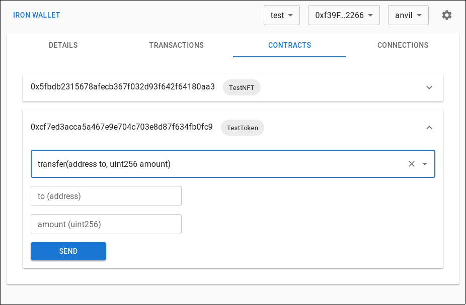

# Iron Wallet

[good-first-issue]: https://github.com/naps62/iron/issues?q=is%3Aopen+is%3Aissue+label%3A%22good+first+issue%22
[justfile]: https://github.com/casey/just
[releases]: https://github.com/iron-wallet/iron/releases
[prank-wallet]: https://ethglobal.com/showcase/prank-wallet-cgnb3
[anvil]: https://book.getfoundry.sh/anvil/

A developer's crypto wallet.



## Features / Roadmap

- [x] **Metamask drop-in replacement**
  - [x] "Connect with MetaMask"
  - [x] base EIP-1193 support
  - [x] submit transactions, sign messages without intrusive popups
- [x] **[anvil][anvil]-aware**
  - [x] track transaction history
  - [x] track deployed smart contracts (via traces, so internal deploys are also detected)
  - [x] automatically track chain restarts / reverts / nonce updates
  - [x] track local foundry projects, sync ABIs and deploys (https://github.com/iron-wallet/iron/pull/166)
- [ ] connection list
  - [ ] fork & simulate mainnet transactions locally. for debugging & security (prototype at [ETHGlobal Lisbon][prank-wallet])
  - [ ] impersonate / prank on any dApp (prototype at [ETHGlobal Lisbon][prank-wallet])
  - [ ] fine-grained control over account and network selection (i.e. different selections per tab, or per domain)
- [ ] UI
  - [x] etherscan-like contract read/write UI for all local contracts (https://github.com/iron-wallet/iron/pull/166)
  - [ ] quick command bar (https://github.com/iron-wallet/iron/pull/182)
  - [x] Dark mode

## Security

**Right now there is none.**
Our "go to market strategy" is to help developers looking to speed up their feedback loop. This means:

- mnemonic defaults to `test test test ... junk`
- no encryption, no passwords to input all the time. just a plain HD Wallet
- no annoying popups for confirmations, gas estimates, etc (they'll come, but opt-in)
- no need to "Reset your Account" to reset the `nonce`

This will change [very very soon](https://github.com/iron-wallet/iron/pull/185) thought, but more future work will include:
- other 3rd party encryption software (e.g.: GPG)
- Hardware wallets
- WalletConnect

---

## Installing

1. Check the latest [release][releases]
2. Download the appropriate binary for your architecture, and set it up in your `$PATH`
3. Download `extension.zip` and manually install it in your browser (currently tested on Google Chrome, more to come soon):
   3.1. Extract the zip file
   3.2. go to `chrome://extensions`
   3.3. enable `Developer mode` (upper right corner)
   3.4. Load unpacked -> choose the directory you extracted from the ZIP file
4. Run `iron`.

---

## Contributing

Check out the [Contribution Guide][./CONTRIBUTING.md]

## Building from source

### Requirements

- Rust
- Node.js (16+ recommended)
- Yarn
- Google Chrome (a profile without MetaMask installed)

There's also an optional [justfile][justfile], if you prefer that over `yarn`.

### Get started

**1. Clone the repo and install dependencies:**

```sh
git clone git@github.com:subvisual/iron && cd iron
```

**2. Run the initial build**, which will install dependencies and build the extension `dist`:

```sh
yarn setup
```

**3. Install the extension**

1. Open Google Chrome
2. go to `chrome://extensions`
3. enable `Developer mode` (upper right corner)
4. Load unpacked -> choose the `iron/extension/dist` directory
5. Iron should now be running

**4. Start the app in development mode**

```sh
yarn app:dev
```

**Note:** If you change the extension' code, you may also need to use `yarn extension:dev`, and to manually reload it on `chrome://extensions`. Live code reloading is tricky with these.
