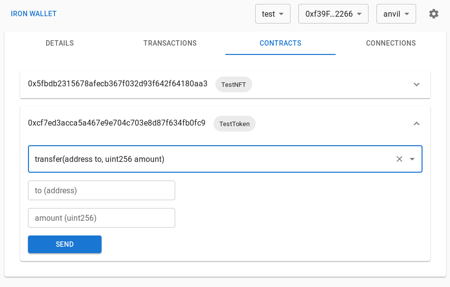

# Iron Wallet

[good-first-issue]: https://github.com/naps62/iron/issues?q=is%3Aopen+is%3Aissue+label%3A%22good+first+issue%22
[justfile]: https://github.com/casey/just

A Development-only, anvil-aware crypto wallet.
Ever had to manually reset your MetaMask account to get your `nonce` back to zero on a local test chain? Then have I got a treat for you.

Use your usual "Connect with MetaMask" flows, but with life-chainging quality-of-life:

- defaults to `test test test ... junk`
- no encryption, no passwords to input all the time. just a plain HD Wallet
- no annoying popups for confirmations, gas estimates, etc (they'll come, but opt-in)
- ever had to "Reset your Account"
- active monitoring of `anvil` networks, monitoring restarts
- runs in your desktop, not your browser (can be closed to the statusbar)



## Features

- [x] Act as a MetaMask drop-in replacement
  - [x] "Connect Wallet" functionality on your browser
  - [x] switching networks
  - [x] switching accounts
  - [x] submitting transactions
  - [x] signing messages
- [x] track transaction history
- [x] track [anvil][anvil] restarts
- [ ] connection list
  - [ ] switch chain/account on individual connections, not just globally
  - [ ] debug transactions and contracts right there on your wallet
  - [ ] track local foundry projects, sync ABIs and deploys
- [ ] other development / debugging features coming soon

---

## Contributing

Pull Requests & Issues are more than welcome! If you have a bug to report, or a feature to suggest, please open an issue.
Search through currently open issues for suggestions on where you may be able to contribute (particularly the [`good-first-issue`][good-first-issue] label).

Read on for a concrete guide on how to get set up.

### Requirements

- Rust
- Node.js (16+ recommended)
- Yarn
- Google Chrome (a profile without MetaMask installed)

There's also an optional [justfile][justfile], if you prefer that over `yarn`.

### Get started

**1. Clone the repo and install dependencies:**

```sh
git clone git@github.com:subvisual/iron && cd iron
```

**2. Run the initial build**, which will install dependencies and build the extension `dist`:

```sh
yarn setup
```

**3. Install the extension**

1. Open Google Chrome
2. go to `chrome://extensions`
3. enable `Developer mode` (upper right corner)
4. Load unpacked -> choose the `iron/extension/dist` directory
5. Iron should now be running

**4. Start the app in development mode**

```sh
yarn app:dev
```

**Note:** If you change the extension' code, you may also need to use `yarn extension:dev`, and to manually reload it on `chrome://extensions`. Live code reloading is tricky with these.
